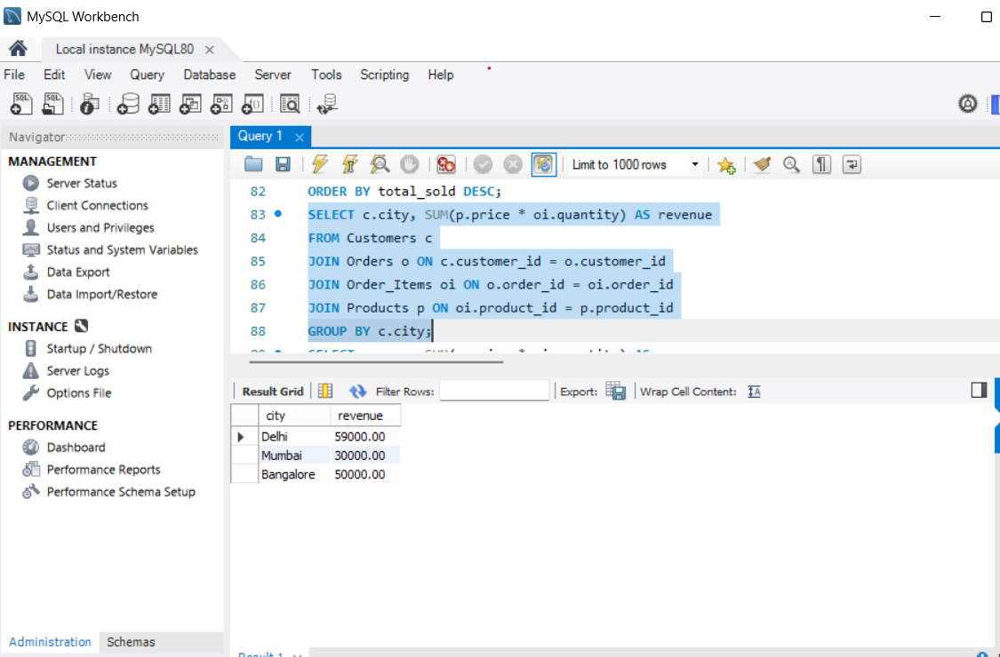
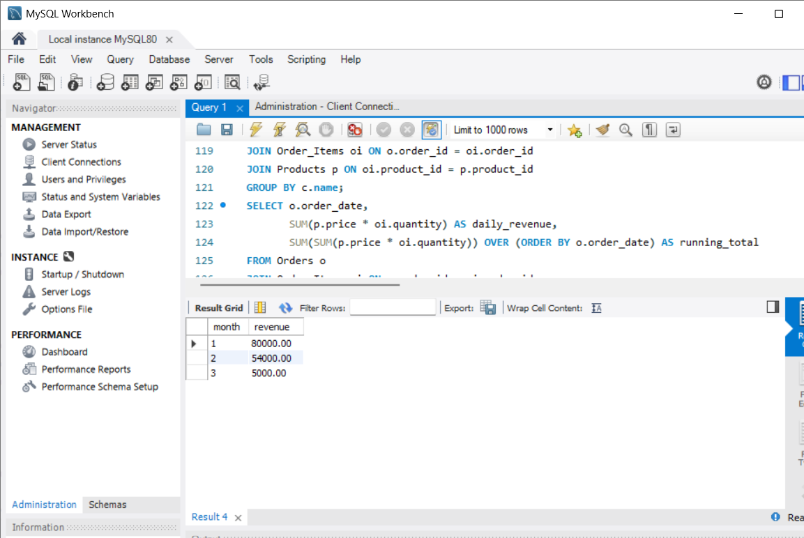

# 📊 Customer Order Analysis using SQL

## 🔍 Overview
This project analyzes customer purchasing behavior and sales trends using SQL on a relational database built in MySQL.

## 🧩 Database Schema
- Customers  
- Orders  
- Products  
- Order_Items  

## 🛠️ SQL Techniques Used
- JOIN operations  
- GROUP BY & aggregations  
- Window functions (RANK, running totals)  
- Conditional logic (CASE statements)  

## 📈 Key Insights
- Top customers contribute the highest share of revenue  
- Delhi generates the highest revenue among cities  
- Electronics category dominates sales  
- Repeat customers generate more revenue than new customers  

## 📂 Project Structure
- schema.sql → Table creation  
- data.sql → Data insertion  
- analysis.sql → SQL queries for insights  

## 📊 Sample Outputs

### Revenue by City

### Top Customers

### Customer Ranking

### Monthly Revenue

### Best Products

## 💻 Tools Used
- MySQL Workbench
